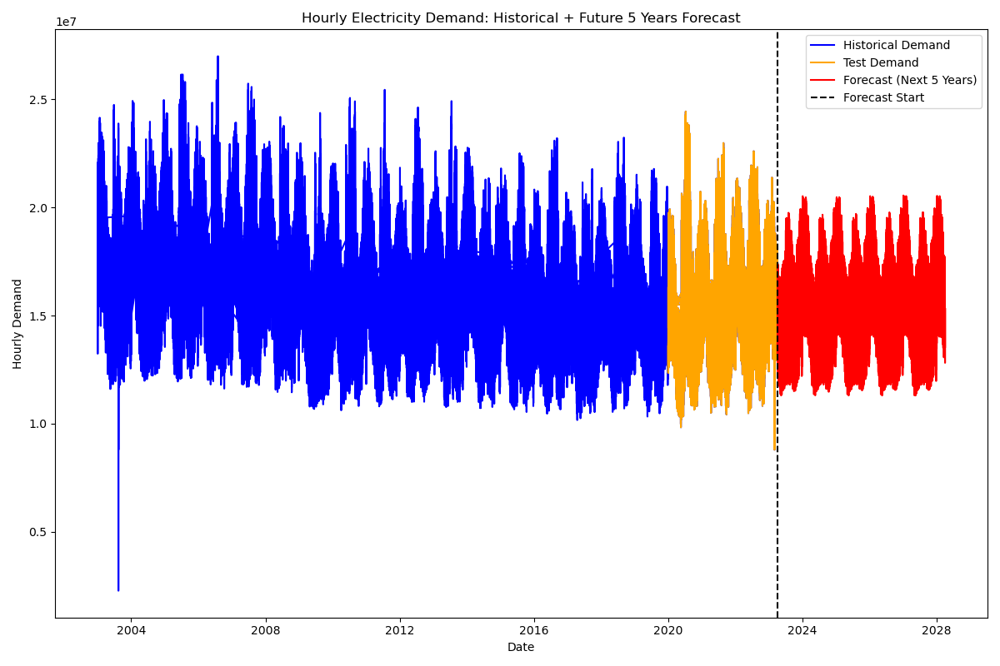

# Ontario Energy Forecasting System

> End-to-end analytics pipeline that combines climate, population, and market signals to forecast hourly electricity demand and price in Ontario.

## Project Highlights
- Unifies hourly load, price, weather, and annual population data (177553 rows, 12 features) into a single modeling-ready dataset.
- Delivers a reproducible workflow that spans data collection, cleansing, feature engineering, forecasting, and evaluation.
- Offers two interactive front ends (Streamlit web app and Tkinter desktop prototype) plus a slide deck, PDF report, and demo video.
- Benchmarks statistical and machine learning models (ARIMA, SARIMA, XGBoost, LightGBM, RandomForest) and packages their predictions as ready-to-use visuals.

## Quick Visual Tour





[](https://www.youtube.com/watch?v=fHaWhkqskY0)

Prefer an offline copy? Use `group2-forecasting-ontario-energy-demand-demo.mp4` in the repository root.

## Repository Guide
```
.
|-- main.py                                   # Streamlit web application entry point
|-- 2.py                                      # Tkinter desktop prototype
|-- data.csv                                  # Hourly demand, price, weather, and population dataset
|-- requirements.txt                          # Minimal Python dependencies
|-- group2-1-data-collection-preprocessing.ipynb
|-- group2-2-visualization-feature-engineering-forecasting.ipynb
|-- group2-3-model-evaluation.ipynb
|-- Visulation/                               # Exploratory and explanatory figures
|-- predict/                                  # Model forecast snapshots
|-- Evaluation/                               # Evaluation charts and confusion matrices
|-- group2-forecasting-ontario-energy-demand-demo.mp4
|-- group2-forecasting-ontario-energy-demand-with-climate-population-data.pdf
|-- group2-forecasting-ontario-energy-demand.pptx
```

## Dataset Overview (`data.csv`)
| Column | Description |
| --- | --- |
| `datetime` | Hourly timestamp formatted as DD/MM/YYYY HH:MM. |
| `hourly_demand` | Reported electricity load (IESO units). |
| `hourly_average_price` | Hourly average market price. |
| `population` | Ontario population estimate for the corresponding year. |
| `Temp (deg C)` | Instantaneous air temperature. |
| `Dew Point Temp (deg C)` | Dew point temperature. |
| `Rel Hum (%)` | Relative humidity. |
| `Wind Dir (10s deg)` | Wind direction in deca-degrees. |
| `Wind Spd (km/h)` | Wind speed. |
| `Visibility (km)` | Observed visibility. |
| `Stn Press (kPa)` | Station air pressure. |
| `Wind Chill` | Calculated wind chill factor. |

Tip: when reading `data.csv` on Windows, specify `encoding="utf-8"` to avoid console warnings.

## Workflow
1. **Data Collection and Preprocessing (`group2-1` notebook)**  
   Scrape weather records, align population data, and merge with historical load and price feeds. Missing climate measurements are interpolated before exporting the consolidated `data.csv`.
2. **Visualization, Feature Engineering, and Forecasting (`group2-2` notebook)**  
   Explore seasonality, correlations, mutual information, and clustering. Build time-series aware features (lags, rolling stats, seasonal indicators) and train ARIMA/SARIMA plus gradient boosting models for demand and price.
3. **Model Evaluation (`group2-3` notebook)**  
   Compare accuracy, precision, recall, F1-score, and residual diagnostics. Summaries are captured as radar charts, confusion matrices, and side-by-side plots.

## Running the Applications
1. Create and activate a virtual environment (example):
   ```bash
   python -m venv .venv
   .venv\Scripts\activate      # Windows
   source .venv/bin/activate   # macOS or Linux
   ```
2. Install dependencies:
   ```bash
   pip install -r requirements.txt
   ```
3. Launch the Streamlit web app:
   ```bash
   streamlit run main.py
   ```
4. Launch the Tkinter desktop prototype (desktop environment required):
   ```bash
   python 2.py
   ```
5. Explore notebooks with Jupyter:
   ```bash
   jupyter lab
   ```
   Execute `group2-1` -> `group2-2` -> `group2-3` to reproduce the full pipeline.

## Key Findings
- Hourly demand exhibits strong seasonal cycles with winter and summer peaks, while shoulder seasons remain moderate.
- Temperature, wind chill, and humidity drive much of the demand variability, as confirmed by mutual information and correlation analysis.
- Extreme weather events explain sudden load spikes, suggesting value in integrating anomaly detection for grid planning.
- Population growth contributes to long-term demand trends; scatter plots validate the positive relationship.
- Boosted tree models (LightGBM, XGBoost) deliver higher precision and F1-scores compared to baseline approaches.

## Suggested Next Steps
1. Expand the feature set with wholesale market indicators and renewable generation outputs.  
2. Incorporate regression metrics (MAE, RMSE) into the evaluation dashboard.  
3. Deploy the Streamlit app to the cloud (Streamlit Community Cloud, Azure, etc.) for team-wide access.  
4. Automate data refresh jobs to ingest new weather and load observations.

## Acknowledgments and Licensing
- Data sources include the Independent Electricity System Operator (IESO) and publicly available climate and population datasets.  
- No explicit license is provided; add one before distributing or open-sourcing the project.

For presentations or reports, pair this README with the included PDF and slide deck to access detailed methodology and results.
